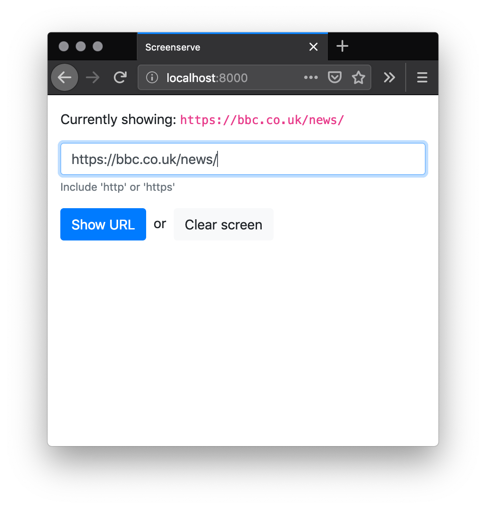

# Tohora

A web UI to run on [balenaDash](https://www.balena.io/blog/make-a-web-frame-with-raspberry-pi-in-30-minutes/).  Make `post` requests with a URL parameter to have the server launch a subprocess and show the submitted URL on screen.



## How to compile

To compile for raspi:

```
env GOOS=linux GOARCH=arm GOARM=5 go build
```

## How to use on a balenaDash device

Copy the binary and `templates` directory onto the raspi and run it:

```
chmod +x tohora
./tohora PORT COMMAND
```

* `PORT` is the port number.  Use 80 for vanilla http
* `COMMAND` is the command that the URL is passed to.  On balenaDash, use `WPELauncher` e.g. `./tohora 80 WPELauncher`.  For manual testing/development try-outs use `sleep` or something equally harmless, e.g. `go run tohora.go 8000 sleep`.

## Access over the internet

In balena, open port 80 on your docker container and turn on the public URL feature.  Then the web UI will be served at the public URL.

## Slack integration

After opening the public URL (see above), add a slack app to allow you to throw URLs onto your screen.  Start at https://api.slack.com/apps?new_app=1 and set up a new "Slash command" like this:


Post or Slack an empty URL or click the 'Clear' button to clear the screen.


tohora Copyright (C) 2019 Richard Morrison www.rmorrison.net

    This program comes with ABSOLUTELY NO WARRANTY; for details see `LICENSE`.
    This is free software, and you are welcome to redistribute it
    under certain conditions; see `LICENSE` for details.